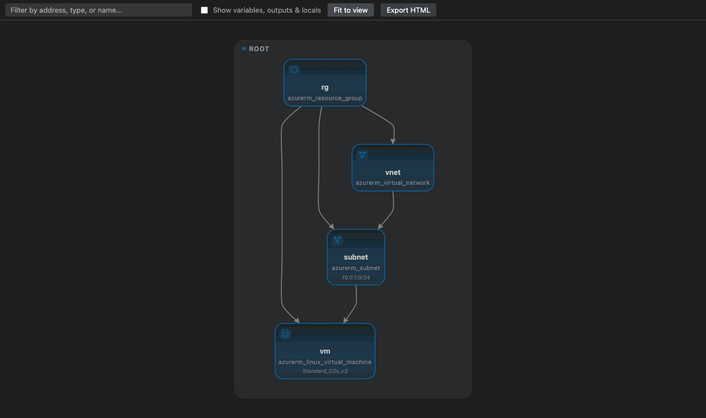
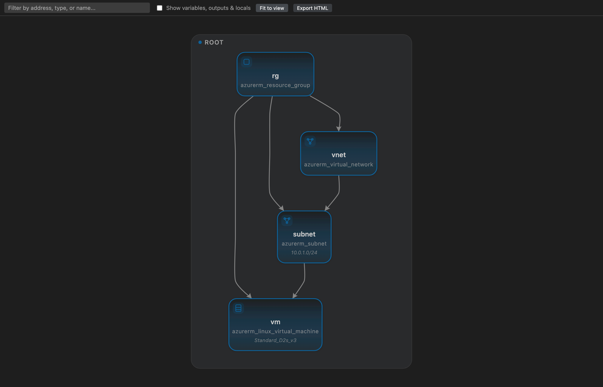
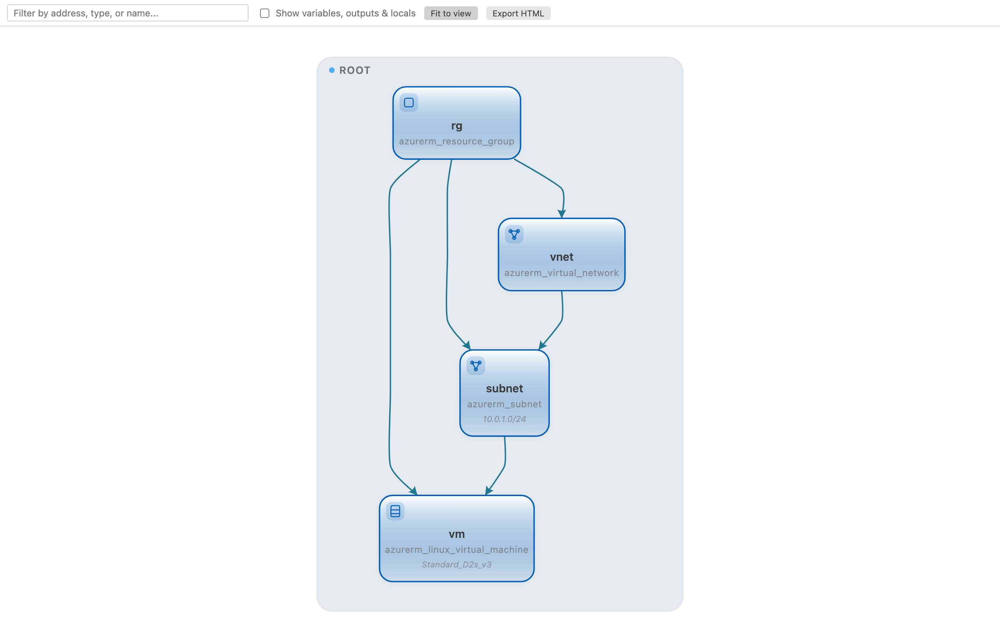
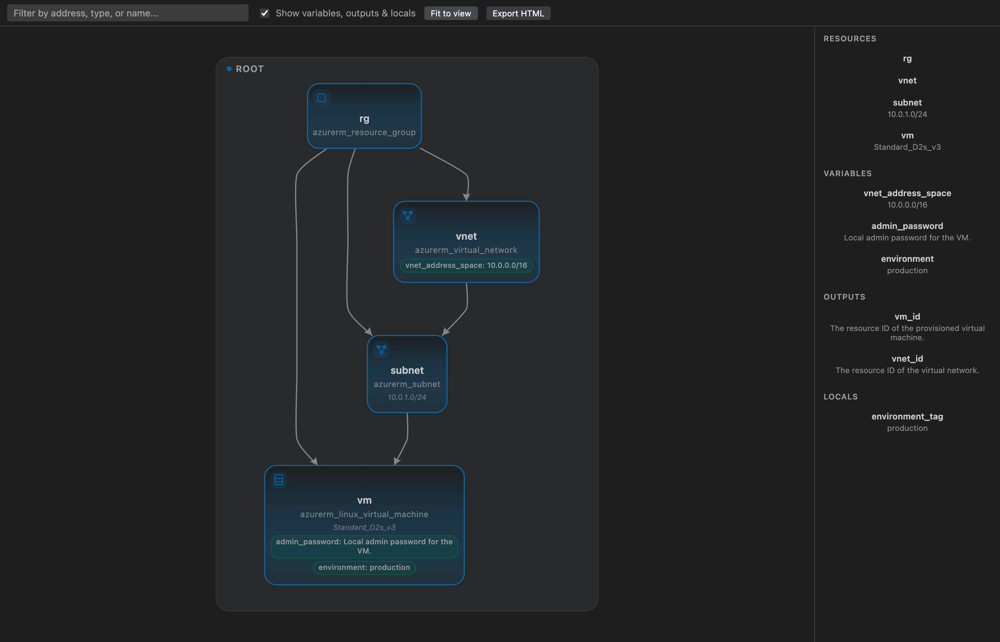
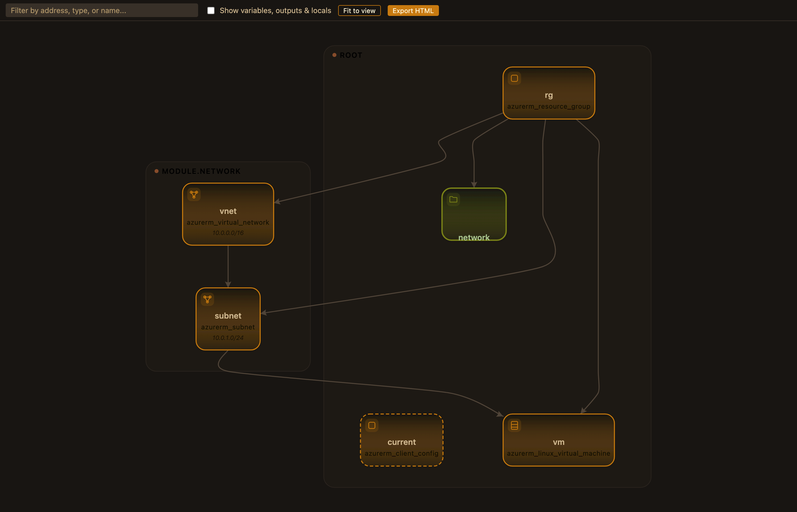

# Terraform Graph Visualizer

A VS Code extension that shows the dependency graph of a Terraform configuration
directory — every resource, data source, and module, and how they reference each
other — the way VS Code's built-in Bicep Visualizer shows a `.bicep` file's resource
graph. Click a node (or a row in the side panel) to jump straight to its block in
the source `.tf` file.

Fully static: parses `.tf` source directly. No `terraform plan`, no cloud
credentials, no network calls.



## Features

- **Static & offline** — parses `.tf` source directly; never runs `terraform
  plan`, never needs cloud credentials or a network call.
- **Cross-module dependency graph** — resources, data sources, and modules,
  with `module.x.output` / `var.x` / `local.x` references resolved across
  scopes, not just within a single file.
- **Click-to-navigate** — click any node, chip, or side-panel row to jump to
  its exact block in the source file.
- **Searchable side panel** — every Resource, Data Source, Module, Variable,
  Output, and Local, filterable by address/type/name.
- **Sensitive-aware detail chips** — CIDR blocks, SKUs, tiers, and other
  literal values surface on cards; `sensitive = true` variables never leak
  their default.
- **Draggable, remembered layout** — reposition any node; layouts persist
  per Terraform directory.
- **Theme-aware** — colors track your actual VS Code theme, light or dark.
- **Export HTML** — save the graph as a single self-contained, interactive
  file that needs no VS Code to open.

|                                     Dark theme                                     |                                     Light theme                                     |
| :----------------------------------------------------------------------------------: | :-----------------------------------------------------------------------------------: |
|  |  |

|                                                 Side panel + variable chips                                                 |                                              Cross-module graph, custom theme                                              |
| :---------------------------------------------------------------------------------------------------------------------------: | :----------------------------------------------------------------------------------------------------------------------------: |
|  |  |

## Usage

1. Open a folder containing `.tf` files.
2. Command Palette → **Terraform: Show Dependency Graph** (or the icon in a `.tf`
   file's editor title bar). The graph opens in a panel beside your editor.
3. Click any node, chip, or side-panel row to jump to that block in its source file.
   If the file's already open somewhere, that tab is reused instead of duplicating
   it; otherwise it opens beside the graph panel.
4. **Terraform: Refresh Dependency Graph** re-parses and redraws after you edit.
5. If the wrong directory gets picked (e.g. you had a child module file focused),
   use **Terraform: Show Dependency Graph for Folder…** to pick the right root
   explicitly.
6. Drag any node to reposition it — layouts are remembered per Terraform directory
   (`workspaceState`), so they're still there next time you open the graph. Other
   nodes don't re-flow around a moved one (a deliberate simplification, not a bug);
   edges to a moved node redraw as straight lines instead of the normal curved
   routing.
7. The graph automatically re-fits when you resize the panel/window — no need to
   click "Fit to view" again after a resize, though the button's still there for
   whenever you want to manually recenter.
8. **Export HTML** in the toolbar saves the graph exactly as currently shown
   (dragged positions, the "show variables, outputs & locals" toggle state, your
   real VS Code theme colors) as a single self-contained `.html` file you pick a
   location for — no VS Code required to open it, and it stays interactive
   (pan/zoom/search/toggle) in any browser. The search box itself is intentionally
   *not* carried over — the export always starts unfiltered, since a stale search
   term the recipient never typed would be confusing to open.

### The side panel

Check **"Show variables, outputs & locals"** in the toolbar to reveal a searchable
side panel listing every Resource, Data Source, Module, Variable, Output, and Local
in the config (each section only appears if it has something to show). Each row is
clickable and jumps to source, same as a graph node.

With the toggle on, resource/data cards also show small chips for any variable they
directly reference — e.g. a card might show `environment: production`. A variable
marked `sensitive = true` never shows its default value in a chip or the panel; it
falls back to its `description` if it has one, or is omitted entirely.

The search box filters the graph *and* the side panel together by address/type/name.

## How it works

- A small bundled Go CLI (`tools/tf-hcl-graph`, built on `hashicorp/hcl/v2` — the
  same library Terraform itself uses) parses every `.tf` file in the directory
  (Terraform merges all files in a directory into one logical module regardless of
  filename, and so does this), recursing into local relative-path (`./`, `../`)
  child modules.
- Cross-module references are resolved: a module's `output` reference jumps into
  that child module's scope; a `var.x` reference jumps up into the parent scope
  that supplied it via the `module "x" { ... }` call; `local.x` resolves within the
  same scope. This works because the graph is built from real HCL expression
  parsing (`hcl.Expression.Variables()`), not regex.
- A `resource`/`data` block using `for_each` or `count` expands into one node per
  instance — `azurerm_storage_account.example["a"]`, `azurerm_storage_account.example[0]`
  — matching Terraform's own instance addressing, whenever the value is a literal
  the tool can evaluate without running `terraform plan` (a map/object literal, a
  `toset([...])` of string literals, or a literal number). `each.key`/`each.value`/
  `count.index` are substituted per instance too, so e.g. `name = "vm-${count.index}"`
  shows the real resolved name on each instance's own card. A downstream reference
  to one specific instance (`example["a"].id`) resolves to that instance alone; a
  reference to the whole resource with no index (valid Terraform for "all
  instances at once", e.g. a `for` expression iterating it) fans out to every
  instance instead of being dropped.
- `module` blocks expand the same way: `module.name["a"]`/`module.name[0]`, each
  with its own independently-recursed child scope, so e.g.
  `module.name["a"].some_resource` and `module.name["b"].some_resource` are
  distinct nodes in distinct module clusters, not merged into one. A child
  instance's `var.x` reference resolves up to that same instance's own
  `module.name["a"] { ... }` call attributes — two instances of the same module
  can depend on different things if their own inputs differ.
- Where an attribute's value is a plain literal in source (a CIDR block, a SKU
  name, an instance size — not something derived from another resource), it's
  surfaced as a small curated detail line on the card, picked per resource category
  (network/compute/storage/database/etc. — inferred from the resource type name).
- Resources/data sources get a small category icon (network, compute, storage,
  database, security, and so on — originally-drawn line icons, not a bundled
  cloud-provider icon set, so there's no icon licensing to worry about).
- The graph renders as an interactive SVG: layered/dagre auto-layout (top-down,
  arrows flow from the source/dependency down into whatever depends on it),
  module clustering, soft shadows/gradients, curved edges, pan/zoom, and node
  dragging.
- Colors track your actual VS Code theme — not just background/foreground, but the
  accent colors that distinguish resource/module/config node kinds too. VS Code's
  own `charts.*` color tokens turned out to be an unreliable source for this (most
  themes, including some fairly complete ones, never set them, and VS Code always
  resolves them to *something* regardless, so a naive CSS fallback chain never
  actually triggers) — accents instead derive from tokens themes reliably do set
  (`button.background`, `statusBarItem.remoteBackground`, `focusBorder`), with a
  hue shift applied for distinctness when two node kinds would otherwise land on
  the same token.

## Known v1 limitations

- Registry/git-sourced child modules are shown as opaque nodes (not expanded)
  unless `.terraform/modules/modules.json` already exists from a prior
  `terraform init` — resolving those without requiring `init` first is backlog.
- `count`/`for_each` expansion only applies when the value is a literal written
  directly in source (a map/object literal, `toset([...])` of string literals, or
  a literal number) — one actually knowable without running `terraform plan`. A
  value derived from a variable, another resource, or a function this tool
  doesn't evaluate falls back to a single, unindexed node for that resource,
  same as before this was added.
- No live file-watching yet — use the refresh command after edits.
- Dragging a node doesn't reflow anything else around it, and a node dragged far
  enough can end up visually outside its module's background panel. There's
  currently no button to reset all dragged positions back to auto-layout — clearing
  it means clearing the extension's `workspaceState` manually.
- The bundled `tf-hcl-graph` binary currently ships for the platform it was built
  on only; proper per-platform binary bundling is backlog (see `project/todo.md`).

## Development

```
npm install
npm run build              # esbuild: extension host + webview
npm run typecheck
npm test                    # plain unit tests (graph resolution, layout, root resolution)
npm run test:integration    # @vscode/test-electron, launches a real VS Code host
```

Press F5 in VS Code (launch config included) to run a live Extension Development
Host against the bundled `nested_module` fixture.

`tools/tf-hcl-graph` is a separate Go module — `cd tools/tf-hcl-graph && go build -o
tf-hcl-graph . && go test ./...`.

`webview/dev-preview*.html` are dev-only harnesses (not shipped — excluded via
`.vscodeignore`) that load the real built webview bundle directly in a plain
browser, no VS Code involved, useful for iterating on the graph's visuals quickly.
A few variants exist seeded with different faked `--vscode-*` theme tokens (dark,
light, and the real color values from this author's own "Warm Luma"/"Zenith
Readable" VS Code themes) to check the theme-adaptive styling against real palettes,
not just guesses.

### Packaging

```
vsce package --no-dependencies
```

`package.json`'s `repository` field points at this repo, so `vsce` automatically
rewrites this README's relative `images/*` links to `raw.githubusercontent.com`
URLs inside the packaged `readme.md` — the Marketplace listing page will render
them once this repo is pushed and public. The images are also bundled directly
into the `.vsix` (see `.vscodeignore`), so they render in VS Code's local
Extension Details view too, independent of GitHub.
